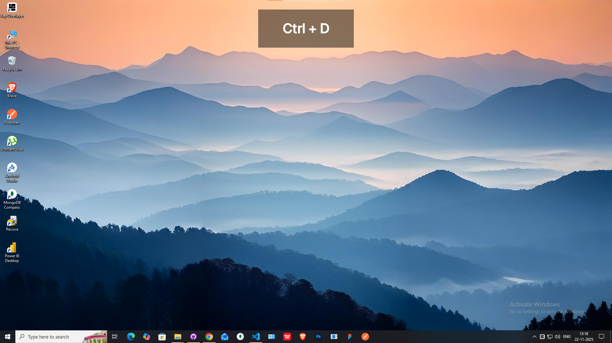

<div align="center">
  

# **Key Overlayer**

A lightweight and customizable on-screen key overlay for Windows.

  
</div>

---

## 🚀 Overview

**KeyOverlayApp** is a simple desktop utility that displays your keystrokes live on an always-on-top transparent window. Perfect for:

* Developers
* Screen recorders and tutorial makers
* Tech presenters
* Live streamers

This project follows a minimal and efficient design philosophy.

Downloads and installers are available from the [Releases page](https://github.com/thinakaranmanokaran/Key_Overlayer/releases).

---

## ✨ Features

* Real-time display of typed keys
* Transparent overlay window
* Draggable screen position
* System Tray integration
* Auto-start and exit options
* Lightweight and resource-friendly

---

## 🧰 Tech Stack

* **Java 17**
* **Swing / AWT**
* **Maven**
* Packaged using **jpackage**

---

## 📦 Installation

Download the latest release installer from the **Releases** section in this repository and install normally on Windows.

---

## 🔧 Build Instructions

```bash
mvn clean package
```

Output JAR will be generated in `target/`.

To generate an installer:

```bash
jpackage --input target \
  --main-jar KeyOverlayApp-1.0-SNAPSHOT-jar-with-dependencies.jar \
  --main-class com.example.Main \
  --name KeyOverlayApp \
  --type exe \
  --win-console
```

---

## 👤 Author

**Thinakaran Manokaran**
Portfolio: [https://thinakaran.dev/](https://thinakaran.dev/)

---

## ⭐ Contribute

Pull Requests and Issue reports are welcome.

If you like the project, consider giving it a ⭐ on GitHub!

---
